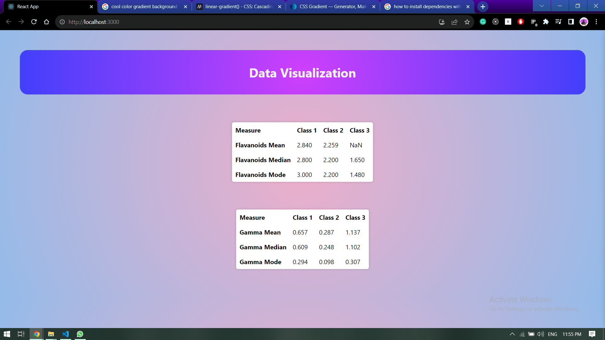

# Data_Visualization_Task
calculate some statistical measures of the Wine Data Set.

for starting the project you need to
1. install all the nodemodule with command:  yarn install 
2. then start the project with command: yarn start 

the output of the program is attached below

